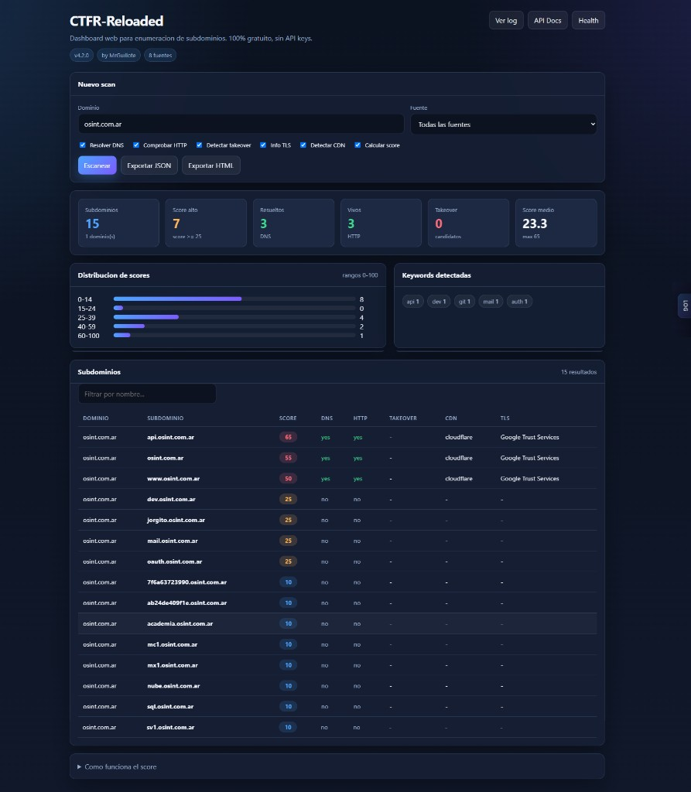
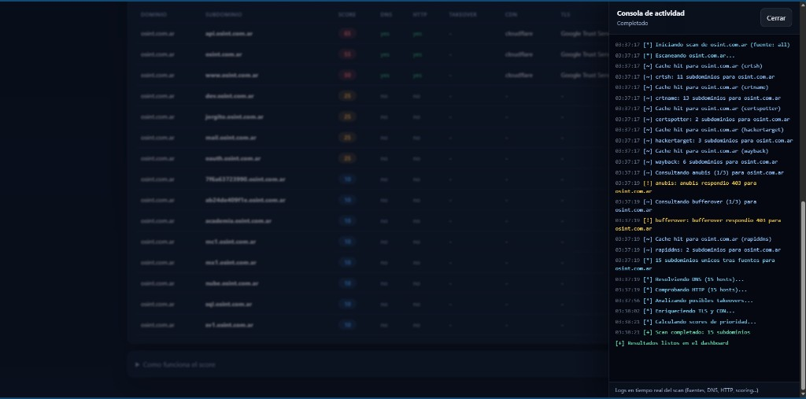

# CTFR-Reloaded

[](https://www.python.org/)
[](LICENSE)
[](https://github.com/MrGuillote/ctfr-reloaded/actions/workflows/ci.yml)
[]()
[](https://pypi.org/project/ctfr-reloaded/)

Herramienta de enumeracion de subdominios **100% gratuita** — sin API keys, sin registro, sin costo.

Desarrollado por [MrGuillote](https://github.com/MrGuillote).

## Demo

### Terminal

<p align="center">
  
</p>

```
$ python ctfr.py -d ejemplo.com --source all --resolve --alive --takeover --tls --cdn --tqdm
[+] 42 subdominios encontrados. Listo!
```

Ver salida completa en [docs/demo-terminal.txt](docs/demo-terminal.txt).

### Dashboard web

<p align="center">
  
</p>

<p align="center">
  
</p>

## Instalacion

### pip (PyPI)

```bash
pip install ctfr-reloaded

# Con extras
pip install "ctfr-reloaded[api,pdf]"
```

### Desde GitHub

```bash
git clone https://github.com/MrGuillote/ctfr-reloaded.git
cd ctfr-reloaded
pip install -e ".[dev,api]"

# Scan full de ejemplo
python ctfr.py -d ejemplo.com --source all --resolve --alive --takeover --tls --cdn --tqdm -v -o reporte.html --format html
```

### Docker (GHCR)

```bash
docker pull ghcr.io/mrguillote/ctfr-reloaded:latest
docker run --rm ghcr.io/mrguillote/ctfr-reloaded:latest -d ejemplo.com
```

## Fuentes gratuitas (8)

| Fuente | Flag | Notas |
|--------|------|-------|
| crt.sh | `crtsh` | Lento, a veces 404/timeout |
| **crt.name** | `crtname` | Rapido, recomendado |
| Certspotter | `certspotter` | |
| HackerTarget | `hackertarget` | |
| Wayback Machine | `wayback` | |
| Anubis | `anubis` | |
| Bufferover | `bufferover` | |
| RapidDNS | `rapiddns` | |
| **Todas** | `all` (default) | |

## Uso rapido

```bash
# Scan basico (todas las fuentes por defecto)
python ctfr.py -d ejemplo.com
```

### Scan FULL (traer todo)

Todas las fuentes + DNS + HTTP + takeover + TLS + CDN + score + reporte HTML:

```bash
python ctfr.py -d ejemplo.com \
  --source all \
  --resolve --alive --takeover --tls --cdn \
  --tqdm -v \
  --history \
  -o reporte.html --format html
```

Equivalente en una linea:

```bash
python ctfr.py -d ejemplo.com --source all --resolve --alive --takeover --tls --cdn --tqdm -v --history -o reporte.html --format html
```

Salida JSON en lugar de HTML:

```bash
python ctfr.py -d ejemplo.com --source all --resolve --alive --takeover --tls --cdn --tqdm -j -o resultados.json
```

Docker (mismo scan full):

```bash
docker run --rm ghcr.io/mrguillote/ctfr-reloaded:latest \
  -d ejemplo.com --source all --resolve --alive --takeover --tls --cdn --tqdm -v -j
```

### Mas ejemplos

```bash
# Recon pro con barra de progreso
python ctfr.py -d ejemplo.com --resolve --alive --takeover --tls --cdn --tqdm

# Reporte PDF
python ctfr.py -d ejemplo.com -o reporte.pdf --format pdf

# TUI interactivo
python ctfr.py -d ejemplo.com --tui

# Watch con alertas Discord
python ctfr.py -d ejemplo.com --watch --interval 1800 \
  --discord-webhook "https://discord.com/api/webhooks/..."

# Pipeline
python ctfr.py -d ejemplo.com --pipe | httpx -silent
```

## Features

| Feature | Flag |
|---------|------|
| Barra tqdm | `--tqdm` |
| TUI interactivo | `--tui` |
| Export PDF | `-o reporte.pdf` |
| Webhook Discord | `--discord-webhook URL` |
| Webhook Telegram | `--telegram-token` + `--telegram-chat-id` |
| Takeover detection | `--takeover` |
| Historial SQLite | `--history` |
| Monitoreo | `--watch --interval SEC` |
| Desactivar score | `--no-score` |

## Score (priorizacion)

Cada subdominio recibe un **score de 0 a 100** para ordenar resultados: arriba van los que conviene revisar primero en un pentest u OSINT.

**No es un nivel de riesgo real** ni confirma vulnerabilidades; es una heuristica de prioridad.

| Factor | Puntos |
|--------|--------|
| Base | +10 |
| Palabra clave interesante en el nombre (`api`, `dev`, `mail`, `admin`, `test`, `git`, etc.) | +15 por match |
| Resuelve DNS (`--resolve`) | +10 |
| Responde HTTP (`--alive`) | +20 |
| Posible subdomain takeover (`--takeover`) | +50 |
| Deteccion CDN (`--cdn`) | +5 |
| Info TLS (`--tls`) | +5 |
| Nombre corto (apex o pocas partes, ej. `ejemplo.com`) | +5 |

Ejemplo sin flags extra:

```
api.ejemplo.com     → 25  (10 + keyword "api")
dev.ejemplo.com     → 25  (10 + keyword "dev")
ejemplo.com         → 15  (10 + nombre corto)
www.ejemplo.com     → 10  (solo base)
```

Con `--resolve --alive --takeover` los scores suben segun lo que se detecte en cada host. Para desactivar el calculo: `--no-score`.

## API local y dashboard web

```bash
pip install "ctfr-reloaded[api]"
python -m ctfr_reloaded serve
```

| URL | Descripcion |
|-----|-------------|
| http://127.0.0.1:9473/ | **Dashboard web** — formulario, estadisticas, tabla interactiva |
| http://127.0.0.1:9473/docs | Documentacion API (Swagger) |
| http://127.0.0.1:9473/scan?domain=ejemplo.com | Scan JSON basico |
| http://127.0.0.1:9473/scan?domain=ejemplo.com&source=all&resolve=true&alive=true&takeover=true&tls=true&cdn=true&score=true | Scan FULL (API) |
| http://127.0.0.1:9473/health | Estado del servidor |

Puerto por defecto: **9473** (configurable con `--port`).

El dashboard incluye tarjetas de estadisticas, distribucion de scores, keywords detectadas, filtro y orden por columnas, export a JSON/HTML, y una **consola lateral en vivo** durante el scan (logs de fuentes, DNS, HTTP, etc.). Ver captura en la seccion [Dashboard web](#dashboard-web) arriba. El reporte `-o reporte.html` usa el mismo diseno.

## Publicar en PyPI (mantenedores)

1. Crear release `v4.2.0` en GitHub
2. Configurar secret `PYPI_API_TOKEN` en el repo
3. El workflow `publish-pypi.yml` publica automaticamente

## Desarrollo

```bash
pip install -e ".[dev]"
pytest
```

## Reportar bugs

Usa los [issue templates](.github/ISSUE_TEMPLATE/) del repo.

## Licencia

GPL v3 — [LICENSE](LICENSE)
